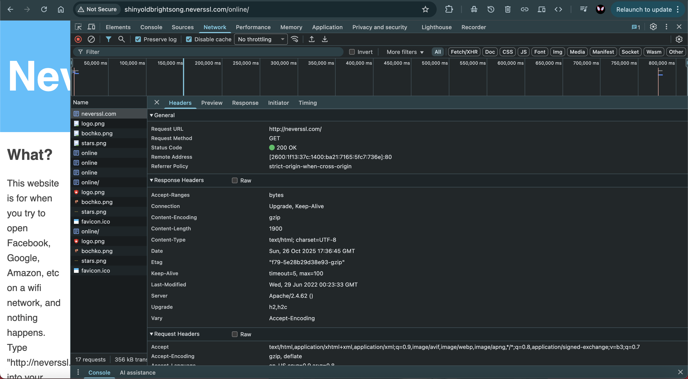
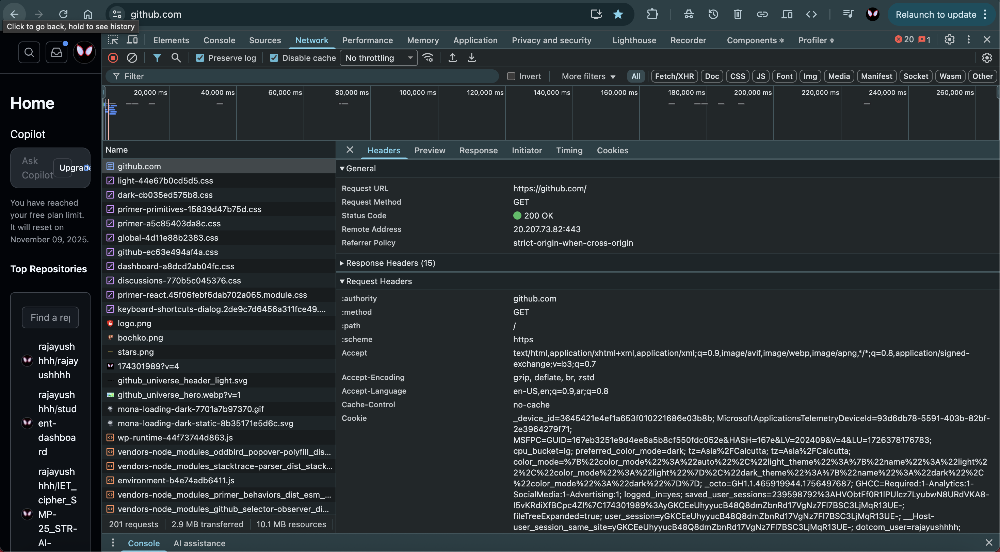

# Browser DevTools Analysis

## 1. HTTP vs HTTPS Comparison

### Screenshots
- HTTP site (neverssl): `./screenshots/browser-http.png`  
  

- HTTPS site (github): `./screenshots/browser-https.png`  
  

### Observations
**Can you see the actual data in HTTP requests?**  
Yes. For `http://neverssl.com`, DevTools shows the response body in plaintext (see screenshot). This content is sent without encryption over the network. We can see the preview of complete website in the preview section as well. 

**Can you see the actual data in HTTPS requests?**  
DevTools shows headers and the response body for `https://github.com` because the browser decrypts TLS traffic internally. However, the data transmitted over the network is encrypted with TLS and cannot be read by a passive network observer but still we can see that the HTML got rendered already because the browser already decrypted it.

**Why is HTTPS more secure?**  
HTTPS uses TLS to:
- encrypt the data in transit i.e. keeps the data confidential,
- ensure data integrity ,
- authenticate the server .

## 2. Request Analysis

### Total requests
- `http://neverssl.com` → **[5]** requests  
- `https://github.com` → **[224]** requests  
- `https://youtube.com` → **[122]** requests

### Resource types loaded
- neverssl: [document, image, stylesheet, ...]  
- github: [document, script, stylesheet, font, xhr, ...]  
- youtube: [document, script, media, image, xhr, ...]  

### Which site made most requests and why?
**[github.com]**  made the most requests because it is a complex, dynamic web application that loads many individual assets.  
Each part of the page (user avatars, icons, CSS themes, JavaScript bundles, and API data) is loaded through separate network requests.  
GitHub also uses HTTPS and HTTP/2 multiplexing, which allows many small requests to be made efficiently to different subdomains. 

## 3. Performance Insights

### Page load times (as reported by DevTools)
- neverssl: **[2.46s / 2.83s]** (Load / Finish)  
- github: **[2.01s / 7.54s]**  
- youtube: **[2.8s / 8.29s]**

### Longest requests and timing breakdown
- neverssl: 
Selected slow request: **[online/]**  
- Stalled: **[0.40ms]**
- DNS Lookup: **[0.019ms]**  
- Connection Time (TCP/TLS): **[353.12ms]**  (old static server)
- Waiting for server response: **[353.12ms]**  
- Content Download: **[3.50ms]**

- github:
Selected slow request: **[github.com]**  
- Stalled: **[4.10ms]**
- DNS Lookup: **[0.005ms]**  
- SSL: **[47.30ms]**  
- Waiting for server response: **[503.67ms]**  (complex server-side rendering)
- Content Download: **[52ms]**

- youtube:
Selected slow request: **[www.youtube.com]**  
- Queueing: **[1.02ms]**  
- Router Evaluation: **[3.46ms]**  
- Waiting for server response: **[240.27ms]**  
- Content Download: **[1.17s]** (large media content)

### Timing Phases Explained 

- **Stalled / Queueing:** The browser was waiting for its turn to send the request.  
- **DNS Lookup:** The browser searched for the website’s address (IP) before connecting.  
- **Connection Tume:** The browser and website connected and made sure they could talk properly.  
- **Waiting (TTFB):** The browser waited for the website’s server to start sending something back.  
- **Content Download:** The browser received and downloaded the page or file from the server.  
- **Router Evaluation:** The browser quickly checked if it could use saved data (cache) instead of loading again.

---

