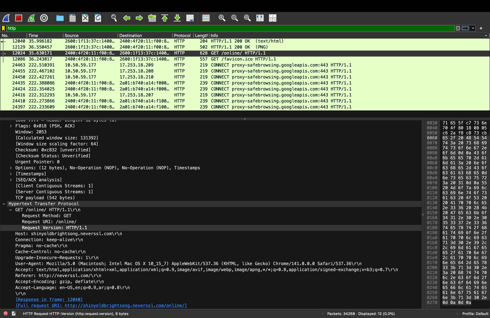

# 🧪 Wireshark Packet Analysis  
**Tool Used:** Wireshark  
**Capture Duration:** 5 minutes  
**Websites Visited:** (same 3 as in Part A)  

---

## **1️⃣ Protocol Distribution**

### **Protocol Hierarchy Screenshot**
- Protocol Hierarchy: `./screenshots/protocol-hierarchy.png`  
  

### **Top 5 Protocols Observed**

| Rank | Protocol | % Packets | % Bytes | Description |
|------|-----------|------------|----------|--------------|
| 1 | Internet Protocol Version 4 (IPv4) | 73.6% | 2.0% | Main protocol used for sending data between devices on the internet. |
| 2 | Transmission Control Protocol (TCP) | 71.8% | 2.3% | Ensures reliable, ordered delivery of data packets. |
| 3 | Transport Layer Security (TLS) | 17.5% | 83.1% | Encrypts data for secure communication (used in HTTPS). |
| 4 | Internet Protocol Version 6 (IPv6) | 17.3% | 9.8% | Newer version of IP with larger address space and improved security. |
| 5 | Address Resolution Protocol (ARP) | 8.0% | 0.3% | Maps IP addresses to physical MAC addresses within the local network. |

### **Summary**
The top five protocols observed were IPv4 (73.6%), TCP (71.8%), TLS (17.5%), IPv6 (17.3%), and ARP (8.0%), showing that most network traffic was secure and based on IPv4 over TCP.

- **IPv4** → like the postal system, it delivers data to the correct address.  
- **TCP** → ensures the delivery is reliable and packets arrive in order.  
- **TLS** → encrypts everything, keeping data private.  
- **IPv6** → newer version of IPv4 with more capacity.  
- **ARP** → works like a local phonebook for IP-to-MAC mapping.  

Together, these make sure our internet traffic is **delivered correctly, securely, and efficiently**.

---

## **2️⃣ DNS Query Analysis**

### **Filter Used:**  dns

### **Captured DNS Queries**

| # | Domain Queried | DNS Server IP | Response IP | Response Time |
|---|----------------|----------------|--------------|----------------|
| 1 | github.com | 2400:4f20:80:c00:0:20:1:21 | 20.207.73.82 | 4.313 ms |
| 2 | linkedin.com | 2400:4f20:80:c00:0:20:1:21 | 2620:1ec:50::12 | 2.231 ms |
| 3 | youtube.com | 2400:4f20:80:c00:0:20:1:21 | 2404:6800:4007:838::200e2404:6800:4007:83c::200e2404:6800:4007:81b::200e2404:6800:4007:815::200e | 2.887 ms |

### **Screenshot**
- DNS Query Screenshot: `./screenshots/dns-query.png`  
  

### **Explanation**
- **Domain being queried:** The hostname we want to reach .
- **DNS server IP:** The server that resolves the domain into an IP address.
- **Response IP address:** The actual IP address returned by the DNS server.
- **Response time:** How long it took to receive the DNS reply.

**In simple terms:**  
DNS is like the internet’s phonebook — it converts a website name (like *github.com*) into a numerical address (*20.207.73.82*) so your computer knows where to send the data.

---

## **3️⃣ TCP Three-Way Handshake**

### **Filter Used:**  tcp.flags.syn==1

### **Captured Packets (Handshake)**

| Step | Frame | Source → Destination | TCP Flags | Description |
|------|--------|----------------------|------------|--------------|
| 1 | Frame 31 | 10.50.59.177 → 150.171.22.12 | SYN | Client wants to start a connection. |
| 2 | Frame 32 | 150.171.22.12 → 10.50.59.177 | SYN, ACK | Server acknowledges the request and responds. |
| 3 | Frame 33 | 10.50.59.177 → 150.171.22.12 | ACK | Client confirms the connection. |
---
### **Screenshot**:
- All 3 Packet: `./screenshots/tcp-handshake.png`  
  
---

### **Explanation (in simple English)**

- **SYN:**  
  The client sends a "hello" signal to start the connection.

- **SYN-ACK:**  
  The server replies, saying “hello back, I’m ready.”

- **ACK:**  
  The client confirms, “great, let’s start talking.”

✅ **Why do we need this handshake?**  
The three-way handshake makes sure both devices:
1. Are ready to communicate.  
2. Agree on all conditions for an effective communication.  
3. Can start sending data.  

Without this, packets might get lost or mixed up.  
It’s like two people saying **“hello”**, **“hello back”**, **“ok, let’s chat”** before starting a conversation.

---

## **4️⃣ HTTP vs HTTPS in Packets**

### **HTTP Traffic**

**Filter Used:**  http

When I applied this filter, I could clearly read the requests and responses.  
I could see details like:

GET /online/ HTTP/1.1\r\n
Request URI: /online/
Request Version: HTTP/1.1
Host: shinyoldbrightsong.neverssl.com/r\n

✅ The content is **plain text** and easy to read.

---

**Screenshot:** - HTTP Packet Screenshot: `./screenshots/http-packet.png`  
  

---

**Conclusion:**  
HTTP is **not encrypted**, so anyone capturing the packets can read everything.

---

### **HTTPS (TLS/SSL) Traffic**

**Filter Used:**  tls

I couldn’t read any of the content — it was all encrypted binary data.

---

**Screenshot:** - HTTPS Packet Screenshot: `./screenshots/https-packet.png`  
  

---

**Conclusion:**  
HTTPS uses **TLS (Transport Layer Security)** to encrypt the data before sending.  
Wireshark can capture the packets but **cannot decrypt** them without the private key.

---

### **Why can’t we see HTTPS content even though we captured it?**

Because HTTPS encrypts the data between your browser and the server.  
Only those two have the secret encryption keys.  
Wireshark, as an outsider, can’t decode what’s inside the encrypted packets.

🔒 **In simple terms:**  
> - **HTTP** = open postcard (anyone can read it)  
> - **HTTPS** = sealed envelope (only sender and receiver can open it)

---

## ✅ **Final Summary**

This Wireshark analysis helped observe how data flows through different network layers:

- **Protocol Hierarchy** showed IPv4 + TCP dominate most traffic.  
- **DNS Queries** translated website names into IP addresses.  
- **TCP Handshake** demonstrated how reliable connections are started.  
- **HTTP vs HTTPS** revealed how encryption hides web content for security.

Together, these analyses show how the internet ensures **communication is fast, organized, and secure** — from domain lookup to encrypted data exchange.

---

