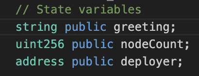

# Part B:  Smart Contract Development

## 1. Contract Code

```solidity 

pragma solidity ^0.8.0;

contract VPNInfo {
    // State variables
    string public greeting;       
    uint256 public nodeCount;     
    address public deployer;     

    constructor() {
        deployer = msg.sender; 
    }

    // Function to set greeting message
    function setGreeting(string memory _greeting) public {
        greeting = _greeting;
    }

    // Function to get greeting message
    function getGreeting() public view returns (string memory) {
        return greeting;
    }

    // Function to set node count
    function setNodeCount(uint256 _count) public {
        nodeCount = _count;
    }

    // Function to get node count
    function getNodeCount() public view returns (uint256) {
        return nodeCount;
    }

    // Function to get deployer's address
    function getDeployerAddress() public view returns (address) {
        return deployer;
    }
}

```

## 2. Solidity Basics

### What is a constructor and when does it run?
A **constructor** function runs only **once** during contract deployment when the contract is deployed first in the blockchain.


### Explain these keywords in your own words:
**public** : makes a function accessible from both inside and outside to anyone.
**private** : restrict access to same contract only even inherited contracts cannot access.
**view** : tells solidity that the function only reaads data from the blockchain and does not change it, no cost gas.
**memory** : used to store temprorary data inside a function.

### What is msg.sender and what information does it give you?
msg.sender is a global variable in Solidity that gives the address of the account that called the function.
It helps identify who is interacting with the contract. We can restrict unwanted users or actions only to deployer.

### Why do we declare variable types like string and uint256?

In solidity variables must have a type because it tells the compiler what kind of data to store, how much space it takes, how can it be used in operations.

## 3. Understanding State

### What is a "state variable" in a smart contract?
A state variable is a variable stored permanently on the blockchain. 

### Where are state variables stored?
They are stored in the blockchain, not in local memory.

### What happens to state variables when you restart your computer?
Nothing as they are stored in the blockchain.

### Screenshot:

  `./screenshots/03-contract-code.png`  

  

---

