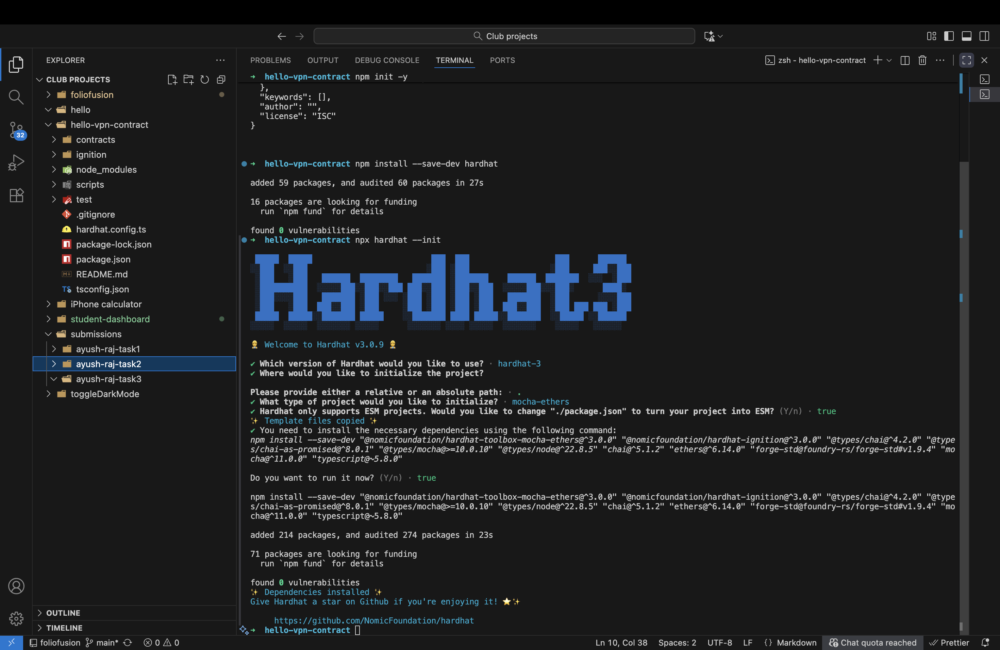
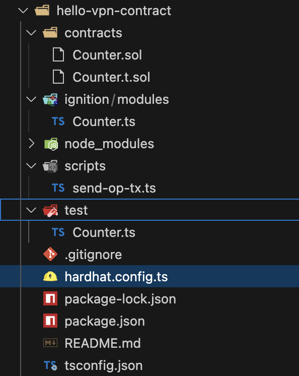

# Task 3: Smart Contract Development & Local Deployment  
## Part A: Development Environment Setup  

---

### 1. Environment Configuration

###  Screenshot of Successful Hardhat Installation
- Screenshot path:  
  `./screenshots/hardhat-installation.png`  
  

---

### Dependencies (from `package.json`)

```json

  "devDependencies": {
    "@nomicfoundation/hardhat-ignition": "^3.0.3",
    "@nomicfoundation/hardhat-toolbox-mocha-ethers": "^3.0.0",
    "@types/chai": "^4.3.20",
    "@types/chai-as-promised": "^8.0.2",
    "@types/mocha": "^10.0.10",
    "@types/node": "^22.18.12",
    "chai": "^5.3.3",
    "ethers": "^6.15.0",
    "forge-std": "github:foundry-rs/forge-std#v1.9.4",
    "hardhat": "^3.0.9",
    "mocha": "^11.7.4",
    "typescript": "~5.8.0"
  }

```


### Screenshot of Project Folder Structure
- **Screenshot path:**  
  `./screenshots/02-project-structure.png`  

  

---

### What is Hardhat and Why Do We Use It?

**Hardhat** is a tool that helps to **build, test, and deploy smart contracts** locally for testing and debugging.

We use it because it lets us test contracts **locally** and run tests with simple commands, also it helps with finding and fixing **errors**

---

### 2. Understanding the Setup

---

#### 📁 What Files Are Automatically Generated by Hardhat?

After setup these were the files :
 hello-vpn-contract/
│
├── contracts/
│ └── Counter.sol
│
├── scripts/
│ └── send-op-tx.ts
│
├── test/
│ └── Counter.ts
│
├── node_modules
├── hardhat.config.js (or hardhat.config.ts)
├── package.json
└── tsconfig.json


---

#### 🗂️ Purpose of Each Folder

- **`contracts/`** — This is where we write our contracts.  
 

- **`scripts/`** — This folder contains our deployment scripts.  


- **`test/`** — This folder is for testing your contracts.  

---

#### ⚙️ What is `hardhat.config.ts`?

`hardhat.config.ts` is the configuration file of our Hardhat project.  
It tells Hardhat which version to use, which network to deploy and any other custom settings.

